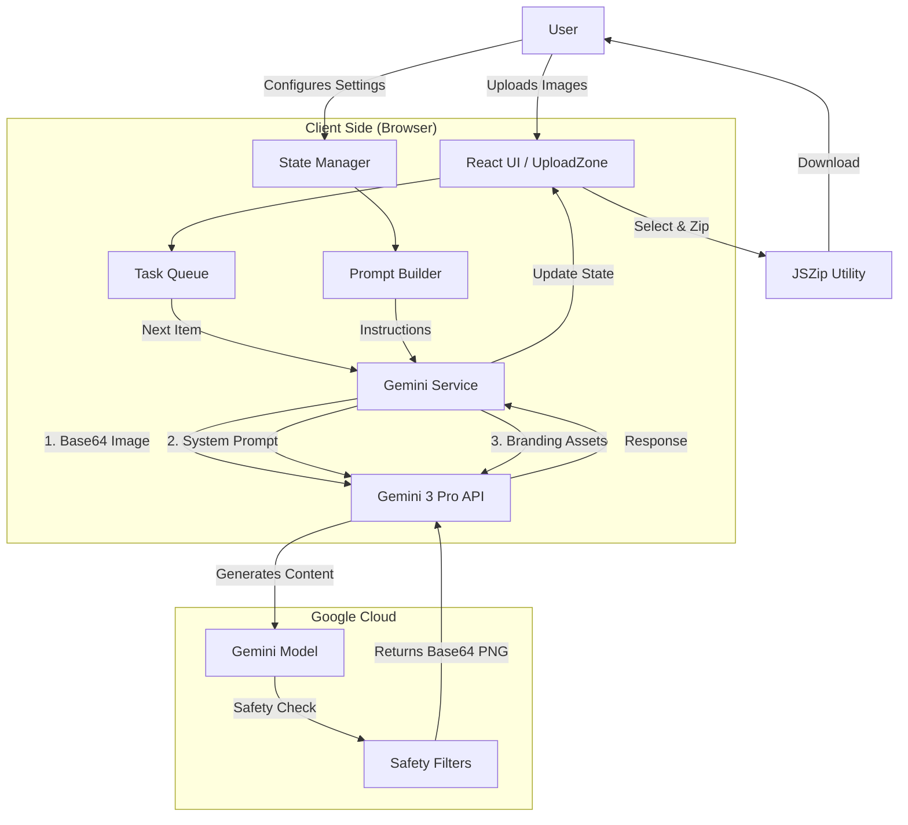

# CultureShift AI

CultureShift AI is a React-based batch processing tool designed to "localize" image galleries for different international markets using Google's Gemini 3 Pro Vision model. 

It takes product or lifestyle photography and adapts the ethnicity of subjects, the environment, architecture, and lighting to match a specific target country, while retaining the original context and composition.

## 🚀 Key Features

*   **Batch Processing**: Upload multiple images at once and process them in a queue.
*   **Cultural Localization**: Select from a list of countries (e.g., Japan, Brazil, Nigeria) to adapt the visual style.
*   **Smart Branding Controls**:
    *   **Remove Branding**: AI identifies and scrubs existing logos/text.
    *   **Color Injection**: Forces specific brand hex codes into the scene (lighting/clothing).
    *   **Logo Composition**: Upload a transparent PNG logo to be realistically composited into the generated scene.
*   **Custom File Naming**: Regex-based engine to rename output files automatically based on input patterns.
*   **Setup Management**: Save and load configuration presets (prompts, countries, regex settings).
*   **Privacy & Billing**: Supports both system-level API keys and user-input keys (for billing tracking).
*   **Bulk Download**: Zip and download selected results.

## 🛠 Tech Stack

*   **Frontend**: React 19
*   **Styling**: Tailwind CSS
*   **AI Model**: Google Gemini 3 Pro Image Preview (`gemini-3-pro-image-preview`)
*   **SDK**: `@google/genai`
*   **Utilities**: `jszip` (compression), `uuid` (state management)

## 🔄 Workflow

1.  **Upload**: User drags and drops a folder of product images into the Upload Zone.
2.  **Configuration**:
    *   Select **Target Country**.
    *   (Optional) Add specific style hints (e.g., "cyberpunk night", "sunny beach").
    *   (Optional) Upload a logo overlay or define brand colors.
    *   (Optional) Enter a specific Gemini API Key.
3.  **Processing**:
    *   The app converts images to Base64.
    *   It constructs a complex prompt combining the visual data, target culture, and branding rules.
    *   Requests are sent sequentially to the Gemini API.
4.  **Review & Export**:
    *   Generated images appear side-by-side with originals.
    *   User selects successful generations.
    *   The app applies Regex renaming rules.
    *   Files are bundled into a ZIP archive for download.

## 📐 Architecture Diagram



## ⚙️ Configuration & Regex Guide

The application uses a powerful Regex engine to rename files automatically upon download.

### Default Behavior
*   **Input**: `inhale-exhale-customneon-mintgreen.jpg`
*   **Output**: `neonLED_mintgreen_171562933.png`

### Logic
1.  **Find Pattern**: `^.*-([^-.]+)\\..*$`
    *   Scans the string until the **last** hyphen.
    *   Captures the text after the hyphen but before the dot (e.g., `mintgreen`).
2.  **Replace Pattern**: `neonLED_$1_TIMESTAMP.png`
    *   `neonLED_`: Static prefix.
    *   `$1`: Inserts the captured text (`mintgreen`).
    *   `TIMESTAMP`: Replaced by the current epoch time to ensure uniqueness.
    *   `.png`: Forces the file extension.

## 📦 Project Structure

```text
├── index.html              # Entry point & Tailwind CDN
├── index.tsx               # React Root
├── App.tsx                 # Main Application Logic & State
├── types.ts                # TypeScript Interfaces
├── metadata.json           # App Metadata
├── components/
│   ├── Header.tsx          # Nav bar & Billing link
│   ├── UploadZone.tsx      # Drag & Drop area
│   └── GalleryItem.tsx     # Individual Image Card
├── services/
│   └── geminiService.ts    # API Interaction & Prompt Engineering
└── utils/
    └── filenameUtils.ts    # Regex Renaming Logic
```

## 🔐 API Key Handling

1.  **System Key**: Can be injected via `process.env.API_KEY` at build/runtime.
2.  **User Key**: Users can enter their own API key in the UI. This is preferred for high-volume users to manage their own billing quotas via Google AI Studio.
